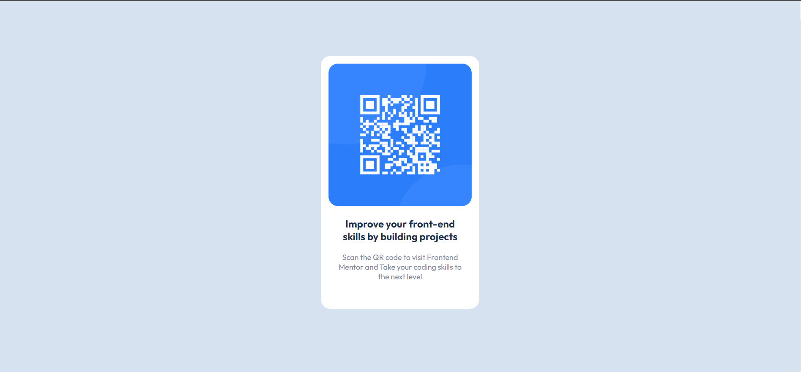

# Frontend Mentor - QR code component solution

This is a solution to the [QR code component challenge on Frontend Mentor](https://www.frontendmentor.io/challenges/qr-code-component-iux_sIO_H). Frontend Mentor challenges help you improve your coding skills by building realistic projects. 

## Table of contents

- [Overview](#overview)
  - [Screenshot](#screenshot)
  - [Links](#links)
- [My process](#my-process)
  - [Built with](#built-with)
  - [What I learned](#what-i-learned)
  - [Continued development](#continued-development)
  - [Useful resources](#useful-resources)
- [Author](#author)
- [Acknowledgments](#acknowledgments)

**Note: Delete this note and update the table of contents based on what sections you keep.**

## Overview

### Screenshot



### Links

- Solution URL: [Add solution URL here](https://your-solution-url.com)
- Live Site URL: [Add live site URL here](https://your-live-site-url.com)

## My process

### Built with

- Semantic HTML5 markup
- CSS custom properties
- Flexbox
- CSS Grid

### What I learned

SCSS basic

```css
@use 'global' as *;

// FONT
@import url('https://fonts.googleapis.com/css2?family=Outfit:wght@400;700&display=swap');

*{
    margin: 0;
    padding: 0;
    box-sizing: border-box;
    font-family: 'Outfit', sans-serif;
}

.container{
    display: grid;
    height: 100vh;
    background-color: $Light-gray;
    grid-template: 1fr / 1fr;
    justify-items: center;
    align-items: center;

    .card{
        width: 250px;
        height: 400px;
        background-color: $White;
        border-radius: 15px;
        padding: 12px;
        display: flex;
        flex-direction: column;

        img{
            width: 100%;
            height: 60%;
            border-radius: 15px;
        }

        .card-body{
            text-align: center;
            padding: 8px;
            
            #card-title{
                color: $Dark-blue;
                font-weight: 700;
                margin: 10px 0 15px 0;
            }

            #card-description{
                color: $Grayish-blue;
                font-size: 12px;
                font-weight: 400px;
            }
        }
    }
}
```

### Continued development

I would like to continue learning more about CSS flexbox and Grid.

### Useful resources

None at the moment

## Author

- Frontend Mentor - [@JuanAguilarDev](https://www.frontendmentor.io/profile/JuanAguilarDev)
- LinkedIn - [@JuanAguilarDev](https://www.linkedin.com/in/juan-manuel-aguilar-garrido-a343141bb/)
